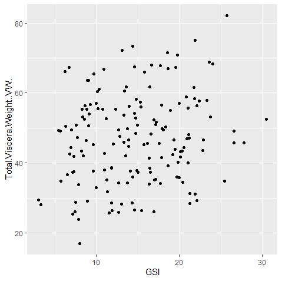

Hurricane Island

File used: Copy of GSI Data Sheet.csv  
  
GSI/Viscera
```
ggplot(GSI, aes(x = GSI, y=Total.Viscera.Weight..VW.)) + geom_point()
```
This attempt at comparing the GSI (Gonadosomatic Index) to the Visceral weight, we may be able to see how the aging and reproductive patterns of the scallops relate to the impact of their internal weight.

  
Gonad Weight / Shell Height
```
ggplot(GSI, aes(Gonad.Weight..GW., y=Shell.Height..SH.)) + geom_point()
```
By comparing the shell weight and shell height we may be able to see changes in the density of either the gonads or the shells themselves, say for instance, if we find that overall weight may not be consistent with the shell height.


Gender Count
```
ggplot(data = GSI) + geom_bar(mapping = aes(x = Sex))
```
This chart gives us a look at the demographic of gender in the scallop sample, which is remarkably close to being even all things considered.


Shell, Height, and Sex
```
ggplot(data = GSI) +
+ geom_point(mapping = aes(x = Shell.Weight..SW., y = Shell.Height..SH., shape = Sex))
```
This chart that compares Shell Weight, Shell Height, and Gender gives us a look to see differences in shell densities to let us see if shell height and the weight are correlated. This could potentially yeild noteworthy finding in terms of the scallops development as well as if the genders are affected differently.
